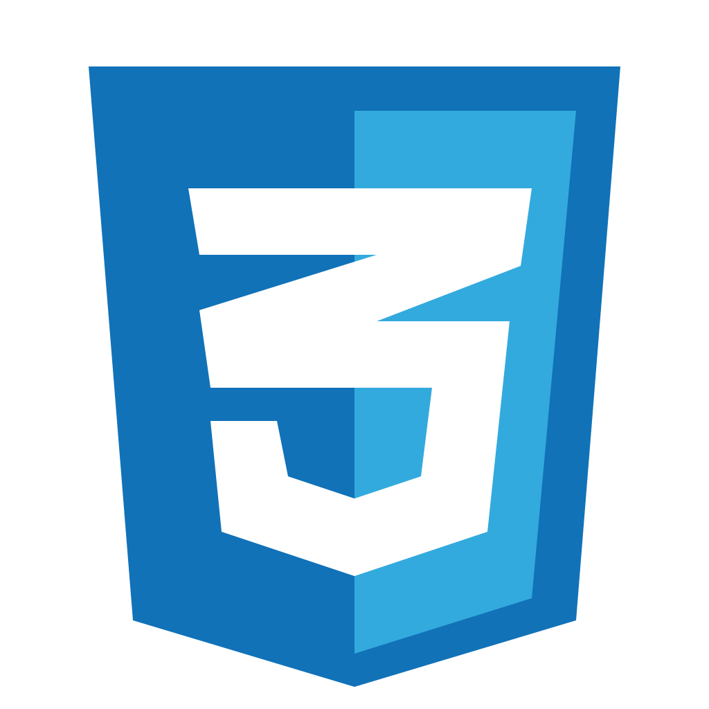

<h2 title="intro"> Hey 👋, MauricioDiazDev</h2>

 
 

 

  

**About Me!**

- 👨🏽‍💻 I’m currently a Junior Web Developer focused on building clean and responsive websites.
- 🌱 I’m currently exploring Artificial Intelligence and its applications in web development.
- 📫 Reach me at mauriciolagunadiaz2003@gmail.com.

**Languages and Tools:**  

<code></code> HTML
<code></code> CSS
<code></code> Javascript
<code></code> PHP
<code></code> Python
<code></code> Java
<code></code> Django
